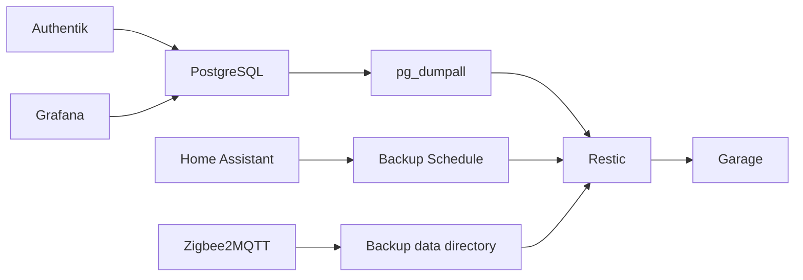

```mermaid
graph LR
  g["Garage"]
  r["Restic"]

  pg["PostgreSQL"]
  pg_dumpall

  hass["Home Assistant"]
  bs["Backup Schedule"]

  z2m["Zigbee2MQTT"]
  bdd["Backup data directory"]

  a["Authentik"]

  gr["Grafana"]

  r --> g
  pg --> pg_dumpall --> r
  hass --> bs --> r
  z2m --> bdd --> r

  a --> pg
  gr --> pg
```
