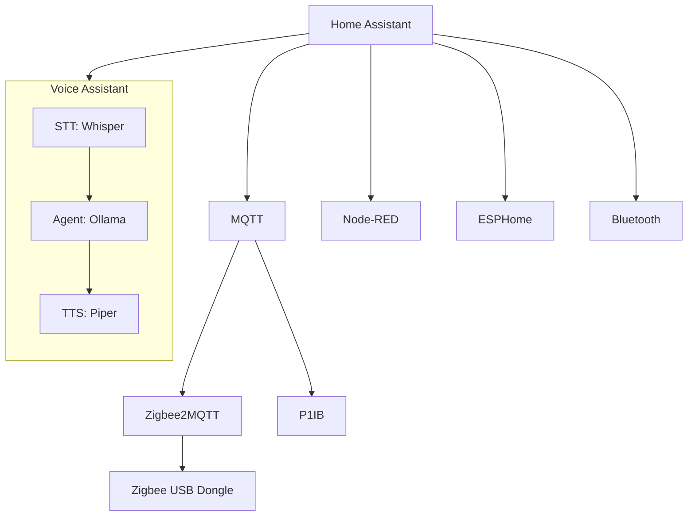

```mermaid
graph
  hass["Home Assistant"]
  z2m["Zigbee2MQTT"]
  mqtt["MQTT"]
  nr["Node-RED"]
  zd["Zigbee USB Dongle"]
  eh["ESPHome"]
  p1ib["P1IB"]
  bt["Bluetooth"]
    w["STT: Whisper"]
    o["Agent: Ollama"]
    p["TTS: Piper"]


  subgraph va["Voice Assistant"]
    direction TB
    w --> o --> p
  end
  hass --> va

  mqtt --> z2m
  z2m --> zd
  hass --> mqtt

  hass --> nr
  hass --> eh
  mqtt --> p1ib

  hass --> bt
```
