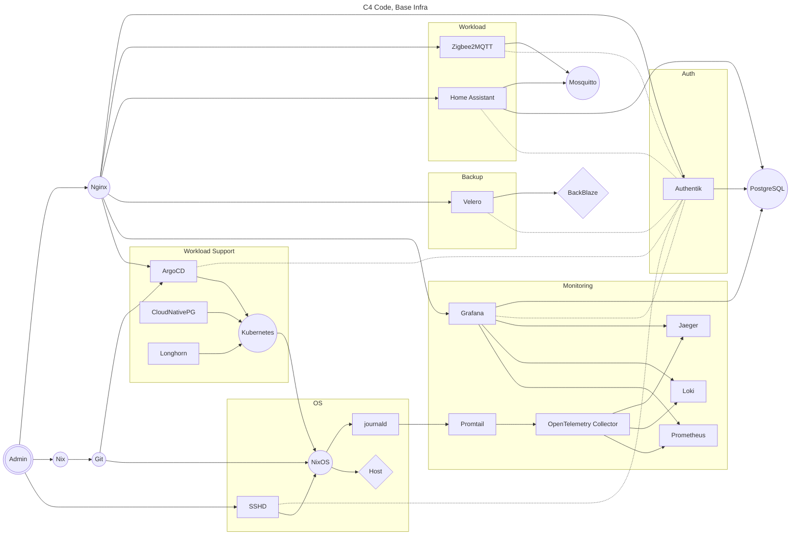
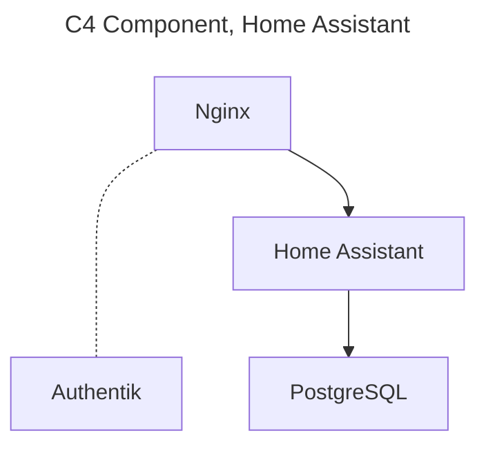
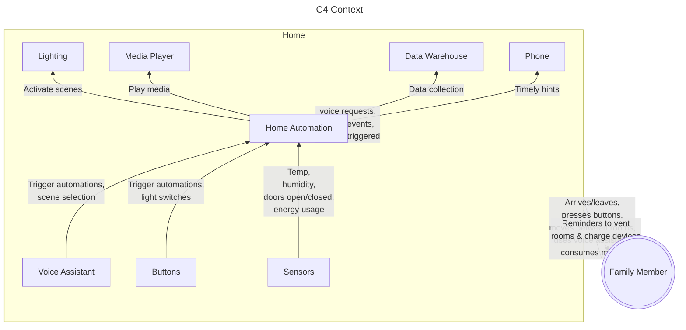
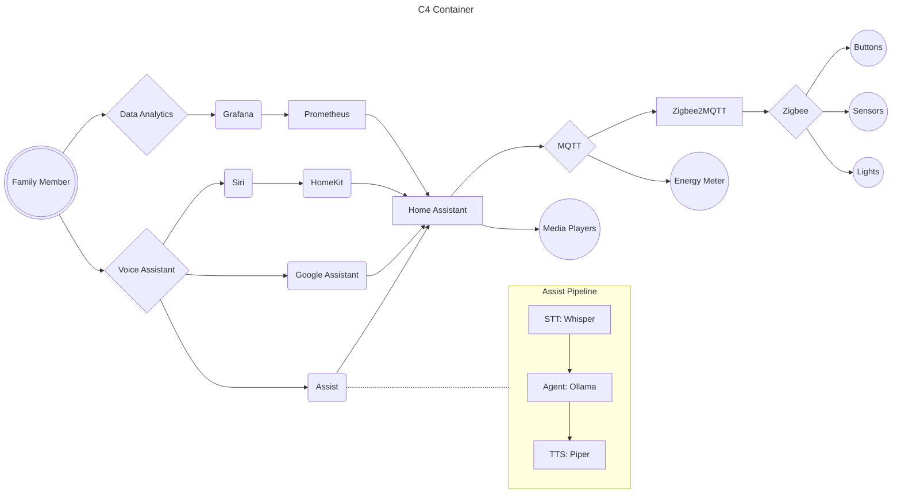

```mermaid
---
title: C4 Code, Base Infra
---
graph LR
  admin(((Admin)))
  admin --> ssh & nix & nginx
  
  nginx --> argo & g & v & hass & z2m & a 

  nginx((Nginx))
  git((Git))

  nix((Nix))
  nix --> git --> n & argo

  subgraph OS
    h{Host}
    n((NixOS))
    jd[journald]
    ssh[SSHD]
  
    ssh --> n
    n --> h & jd
  end

  subgraph Workload Support
    k((Kubernetes))
    cnpg[CloudNativePG]
    lh[Longhorn]
    argo[ArgoCD]
    
    k  --> n
    argo & lh & cnpg --> k
  end


  subgraph Monitoring
    otelcol[OpenTelemetry Collector]
    j[Jaeger]
    p[Prometheus]
    g[Grafana]
    l[Loki]
    pt[Promtail]

    jd --> pt --> otelcol -->  p & l & j 
    g --> p & l & j
  end

  subgraph Workload
    hass[Home Assistant]
    z2m[Zigbee2MQTT]
  end

  subgraph Auth
    a[Authentik]
  end
  hass & g & z2m & ssh & v & argo -..- a

  subgraph Backup
    v[Velero]
  end
  v --> b

  b{BackBlaze}

  pg((PostgreSQL))
  mqtt((Mosquitto))

  a & g & hass --> pg
  hass & z2m --> mqtt
```

```mermaid
---
title: C4 Component, Home Assistant
---
graph
  n[Nginx]
  a[Authentik]
  ha[Home Assistant]
  pg[PostgreSQL]
  
  n -..- a
  n --> ha --> pg 

```

```mermaid
---
title: C4 Context
---
graph BT
  fm(((Family Member)))

  subgraph h[Home]
    direction LR
    ha[Home Automation]
    va[Voice Assistant]
    b[Buttons]
    s[Sensors]
    l[Lighting]
    mp[Media Player]
    da[Data Warehouse]
    p[Phone]
  end

  fm -- Arrives/leaves,
        presses buttons,
        moves between rooms,
        uses voice assistant,
        consumes media
     --> h

  h -- voice requests,
       button events,
       sensors triggered
    --> ha

  h -. Reminders to vent
       rooms & charge devices
    .-> fm

  va -- Trigger automations,
        scene selection
     --> ha

  b -- Trigger automations,
      light switches
    --> ha

  s -- Temp,
       humidity,
       doors open/closed,
       energy usage
    --> ha

  ha -- Activate scenes --> l
  ha -- Play media --> mp
  ha -- Data collection --> da
  ha -- Timely hints --> p
```

```mermaid
---
title: C4 Container
---
graph LR
  fm(((Family Member)))
  b((Buttons))
  s((Sensors))
  l((Lights))
  z{Zigbee}
  z2m[Zigbee2MQTT]
  em((Energy Meter))
  m{MQTT}
  ha[Home Assistant]
  mp((Media Players))
  hk(HomeKit)
  si(Siri)
  ga(Google Assistant)
  p[Prometheus]
  g(Grafana)
  a(Assist)
  w["STT: Whisper"]
  o["Agent: Ollama"]
  pi["TTS: Piper"]

  st{Data Analytics}
  va{Voice Assistant}

  a -..- ap

  subgraph ap[Assist Pipeline]
    w --> o --> pi
  end

  fm --> st --> g
  fm --> va --> si & ga & a
  ga & a --> ha
  si --> hk --> ha
  ha --> m --> z2m --> z -->b & s & l
  ha --> mp
  m --> em
  g --> p --> ha
```
