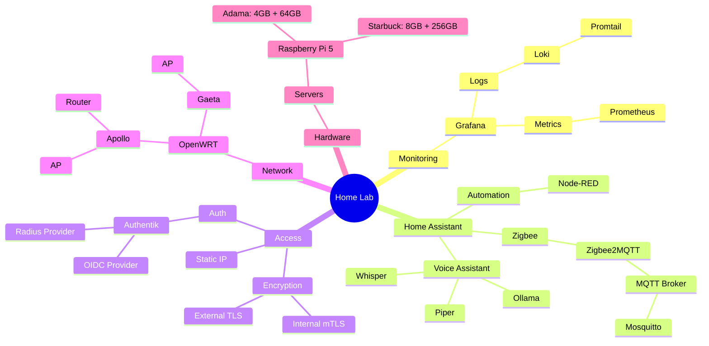
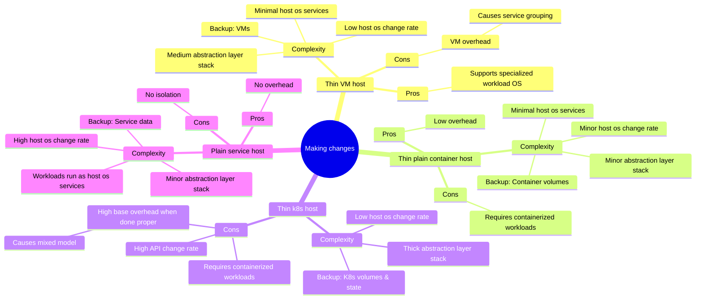
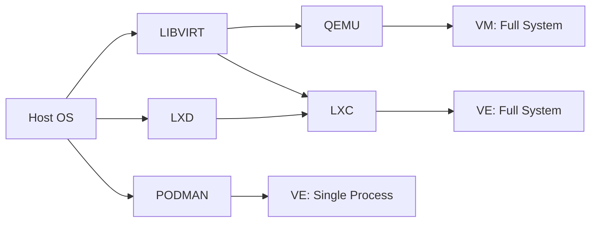
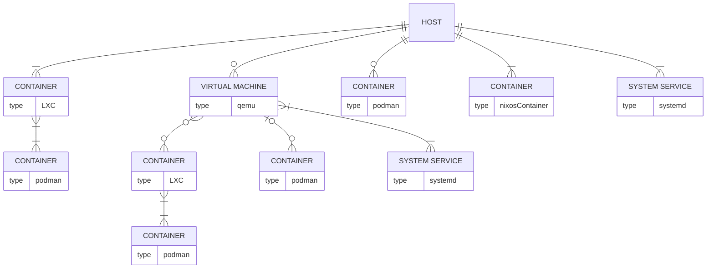
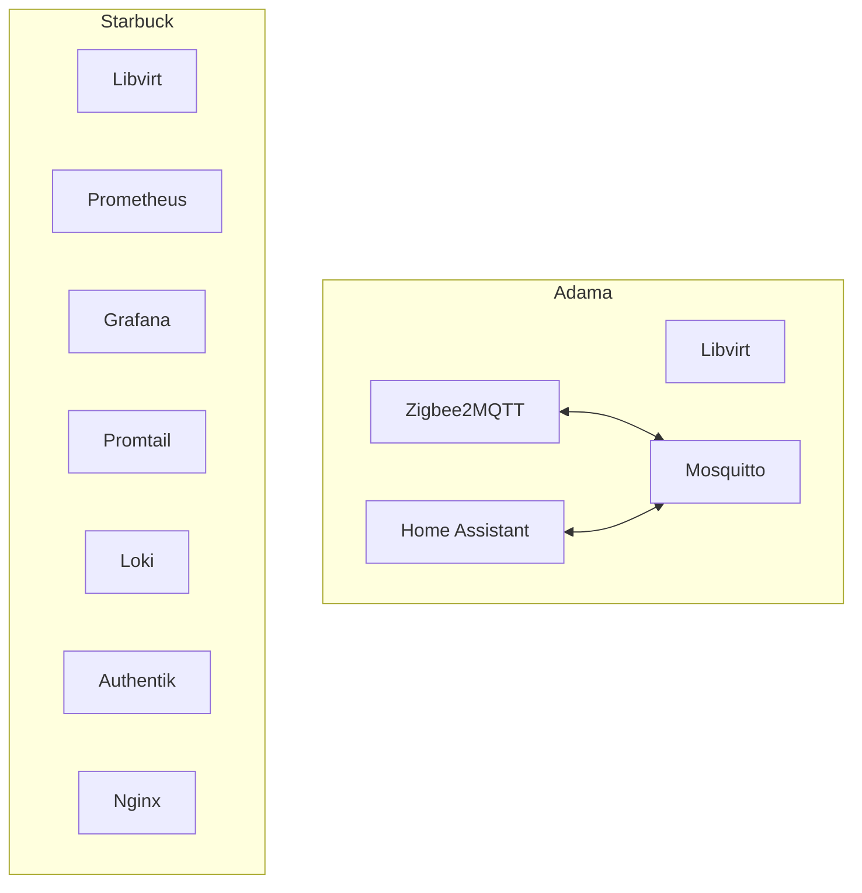

## Workload Management

Meta goals
- Fun to build & use
- Easy maintainance
- Swiftly getting core services back up when hw fails
- Services backed up before upgrades
- Possible to roll back breaking upgrade with restored data
- 

Design goals
- Single deploy flow
- Minimal change disruption
- Reasonable system overhead vs workload ratio
- Backup
  - Local & remote
  - Restore proceedure
- Stable & common solutions
- Low complexity networking
- Explicit resource allocation
- Telemetry
  - Metrics
  - Logging
  - Alerting
- 

## Workloads

