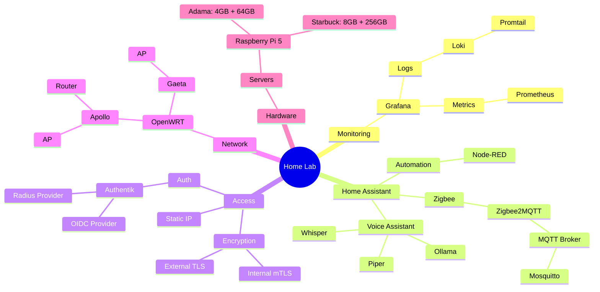
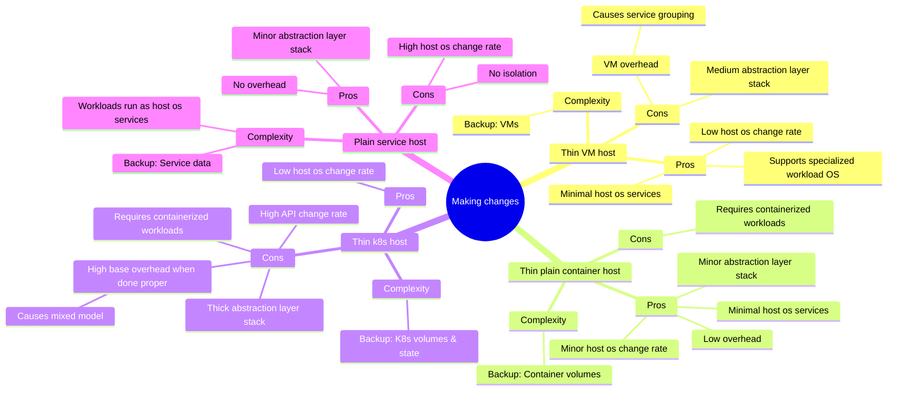
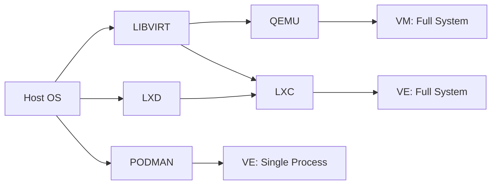

## Workload Management

### Base needs

- Status dashboard
- Revertable changes
- Plan for failure
- Safe tinkering

### Design goals

- Single deploy flow
- Minimal change disruption
- Reasonable system overhead vs workload ratio
- Backup
  - Local & remote
  - Restore proceedure
- Stable & common solutions
- Low complexity networking
- Explicit resource allocation
- Telemetry
  - Metrics
  - Logging
  - Alerting

### Resource management

