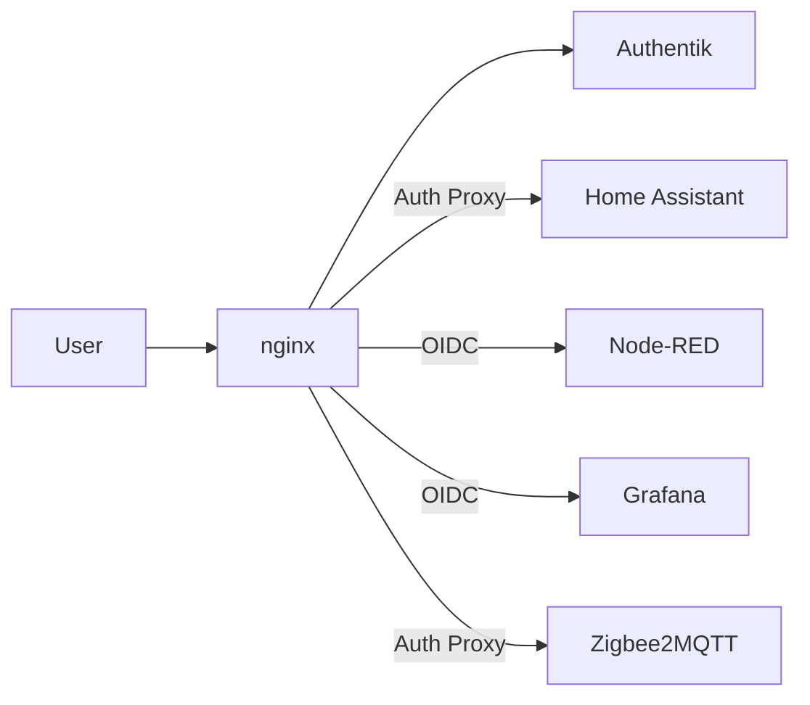

```mermaid
graph LR
  u["User"]
  n["nginx"]
  a["Authentik"]
  hass["Home Assistant"]
  nr["Node-RED"]
  g["Grafana"]
  z2m["Zigbee2MQTT"]

  u --> n

  n --> a
  n -- Auth Proxy --> hass
  n -- OIDC --> nr
  n -- OIDC --> g
  n -- Auth Proxy --> z2m
```
