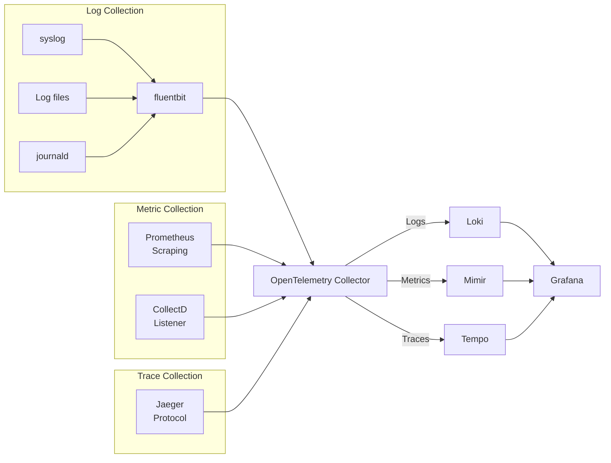

```mermaid
graph LR
  g["Grafana"]
  l["Loki"]
  otelcol["OpenTelemetry Collector"]
  fb["fluentbit"]
  j["journald"]
  lf["Log files"]
  sl["syslog"]
  cd["CollectD\nListener"]
  p["Prometheus\nScraping"]
  m["Mimir"]
  ja["Jaeger\nProtocol"]
  t["Tempo"]

  subgraph Log Collection
    sl & lf & j --> fb 
  end

  fb --> otelcol

  subgraph Metric Collection
    cd
    p
  end

  p & cd --> otelcol

  subgraph Trace Collection
    ja
  end

  ja --> otelcol

  otelcol -- Logs --> l --> g
  otelcol -- Metrics --> m --> g
  otelcol -- Traces --> t --> g
```
